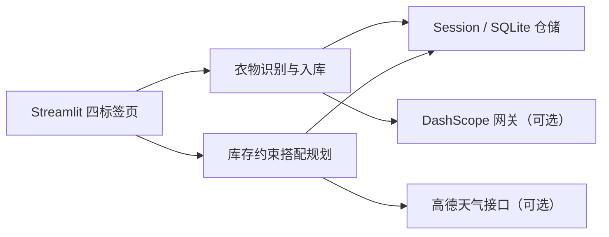

# StyleMate 衣橱管家

StyleMate 是一个面向个人衣橱整理的 Streamlit 项目，串联衣物图片识别、人工校正、入库管理与基于现有库存的确定性穿搭推荐。

下图为 demo 模式加载样例衣橱后的真实产品界面。


## 使用流程

1. 选择 demo 模式加载六件样例衣物，或在 local 模式使用自己的衣橱。
2. 上传 JPG/JPEG、PNG 或 WebP 图片（单张不超过 8 MB）。
3. 使用 DashScope 多模态识别衣物；未配置模型时自动进入手工录入。
4. 校正名称、品类、颜色、材质、季节与风格后确认入库。
5. 输入场景、城市和风格偏好，从当前候选衣橱生成一至三套搭配。

## 架构



## 快速开始

使用 Python 3.11 安装依赖：

```powershell
python -m pip install -r requirements.txt
```

demo 模式的数据仅保存在当前浏览器会话中，无需注册：

```powershell
$env:APP_MODE = "demo"
python -m streamlit run app.py
```

local 模式是默认模式，衣橱记录写入本地 SQLite，上传图片写入本地目录：

```powershell
$env:APP_MODE = "local"
python -m streamlit run app.py
```

## 环境变量

| 变量 | 必填 | 说明 |
| --- | --- | --- |
| `APP_MODE` | 否 | `demo` 或 `local`；默认 `local` |
| `DASHSCOPE_API_KEY` | 否 | DashScope 图片识别密钥；缺失时使用手工录入 |
| `AMAP_API_KEY` | 否 | 高德天气接口密钥；缺失或请求失败时保留规则推荐 |
| `VISION_MODEL_NAME` | 否 | 多模态模型名 |
| `TEXT_MODEL_NAME` | 否 | 文本模型配置名 |

请将密钥放入本地 `.env` 或部署平台的 Secret 设置，不要提交到仓库。

## 离线评测

指标来自已执行的十个固定用例与生成文件 `artifacts/evaluation.json`：

| 指标 | 结果 |
| --- | ---: |
| 衣橱 ID 有效率 | 1.0 |
| 约束通过率 | 0.9 |
| 天气失败降级成功率 | 1.0 |

重新生成评测：

```powershell
python -m evaluation.run_eval --output artifacts/evaluation.json
```

运行测试：

```powershell
python -m pytest -q
```

## 已知限制

- 不提供登录或鉴权。
- demo 模式没有云端持久化；local 模式只保存到运行机器。
- 穿搭组合与评分采用确定性规则，不是训练或微调模型的输出。
- DashScope 与高德接口均为可选；无密钥或请求失败时使用人工录入或规则降级。

## 在线演示

公开地址：**待部署**
