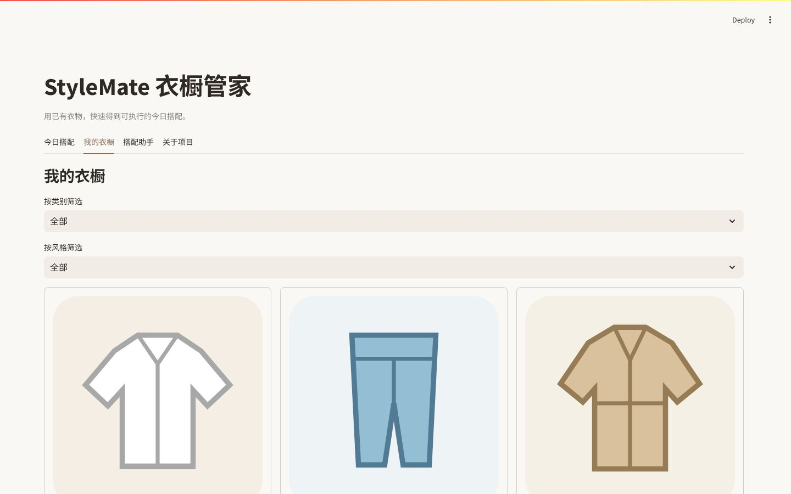

# StyleMate 个人衣橱助手

StyleMate 是一个面向个人使用的 Streamlit 衣橱助手，串联衣物图片识别、人工校正、入库管理、连续对话、天气穿搭和旅行规划。单个有界 LangGraph Agent 负责按需选择工具，衣橱事实和写操作仍由确定性服务控制。项目定位是单用户本地应用，不提供账号体系或多用户 SaaS 能力。

下图为 local 模式加载 128 件演示衣橱后的真实产品界面。



开发交接与 GitHub 发版清单见：[STYLEMATE_HANDOFF.md](docs/STYLEMATE_HANDOFF.md)。

## 使用流程

1. local 模式首次启动时自动初始化 128 件高分辨率演示单品，覆盖上装、下装、外套、连衣裙、鞋履、包袋和配饰。
2. 上传 JPG/JPEG、PNG 或 WebP 图片（单张不超过 8 MB）。
3. 多模态模型先判断图片主体是否为服装、鞋履、包袋或配饰，再生成结构化衣物草稿；非服饰和低置信度图片会被拒绝。
4. 校正名称、品类、颜色、材质、季节与风格后确认入库。
5. 在衣橱 Agent 中连续询问搭配、天气、尺码、洗护和库存问题。
6. Agent 提议新增、修改或删除衣物时，检查操作预览并手动确认。

## 快速开始

使用 Python 3.11 安装依赖：

```powershell
python -m pip install -r requirements.txt
```

demo 模式的数据仅保存在当前浏览器会话中，无需注册：

```powershell
$env:APP_MODE = "demo"
python -m streamlit run app.py
```

local 模式是默认的个人模式，衣橱记录写入本地 SQLite，上传图片写入本地目录；同一运行实例只服务一个本地用户：

```powershell
$env:APP_MODE = "local"
python -m streamlit run app.py --server.port 8511
```

启动后打开 [http://localhost:8511](http://localhost:8511)。这是本地日常使用和面试演示入口；GitHub 仓库本身不提供独立的公共在线演示服务。

第一次创建本地数据库时，应用会从 `assets/demo/wardrobe.json` 初始化 128 件高分辨率演示衣物，并将图片复制到本地图片存储。素材来自 Auckland Museum，经 Wikimedia Commons 核验为 `CC BY 4.0`；manifest 保留创作者、来源页面、原图地址和尺寸。v2 迁移会替换仍存在的旧演示记录并增量加入新记录；用户已删除的演示衣物不会在重启或升级时恢复。若要重新体验全新初始化，应在明确不再需要本地数据后自行移走 `data/stylemate.db` 和 `data/uploads/`。

演示素材授权与完整性审计：`python scripts/audit_demo_sources.py`。

### 本地使用与 GitHub 发布边界

这个仓库同时服务于本地日常使用和公开展示：

- GitHub 保留可复现的源码、测试、知识库、评测结果、128 件 CC BY 4.0 演示图片及其来源说明，别人克隆后可以直接运行并查看完整项目结构。
- 本地 `.env`、`data/stylemate.db`、`data/uploads/`、`data/chroma/` 和用户文档只用于你的个人运行，不提交到 GitHub。`.env.example` 只包含空配置模板。
- 本地模式会把衣橱写入 SQLite；删除衣物后不会因为重启或重新运行迁移而恢复。首次运行若没有数据库，会从仓库内的演示 manifest 初始化 128 件单品。
- 发布前可执行 `git status --ignored` 检查本地数据仍被忽略，再执行 `python -m pytest -q`、`python -m ruff check .` 和 `python scripts/audit_demo_sources.py`。

## 项目结构

```text
StyleMate/
├─ app.py                       # Streamlit 入口
├─ stylemate/                   # 唯一运行时代码包
│  ├─ agent/                    # LangGraph、记忆、工具与 AgentService
│  ├─ config/                   # 运行时配置
│  ├─ demo/                     # 会话级离线样例数据
│  ├─ domain/                   # Pydantic 领域模型
│  ├─ gateways/                 # 多模态与外部服务网关
│  ├─ model/                    # 文本模型工厂
│  ├─ rag/                      # 语料、混合检索与用户文档
│  ├─ repositories/             # Session / SQLite 仓储
│  ├─ rules/                    # 确定性穿搭规则
│  ├─ services/                 # 衣橱、初始化与画像服务
│  ├─ skills/                   # 三个有界领域 Skill
│  ├─ storage/                  # 图片存储
│  ├─ ui/                       # Streamlit 状态与组件
│  └─ prompts/agent_system.txt  # Agent 系统 Prompt
├─ assets/demo/                 # 128 件 CC BY 4.0 商品图、元数据和来源说明
├─ data/knowledge/              # 64 条内置知识记录和来源
├─ evaluation/                  # 固定离线评测
├─ artifacts/                   # 可提交评测结果
├─ scripts/                     # 知识审计和素材构建脚本
├─ tests/                       # 核心回归测试
├─ docs/                        # 截图、简历与交接文档
└─ pyproject.toml               # pytest 与 Ruff 配置
```

## 环境变量

| 变量 | 必填 | 说明 |
| --- | --- | --- |
| `APP_MODE` | 否 | `demo` 或 `local`；默认 `local` |
| `LLM_API_KEY` / `LLM_BASE_URL` | 否 | 主文本模型密钥和 OpenAI-compatible 地址 |
| `VISION_API_KEY` / `VISION_BASE_URL` | 否 | 多模态识别配置；缺失时警告并拒绝带图片入库 |
| `EMBEDDING_API_KEY` / `EMBEDDING_BASE_URL` | 否 | 向量模型配置；缺失或失败时保留 BM25 |
| `AMAP_API_KEY` | 否 | 高德天气接口密钥；缺失或请求失败时保留规则推荐 |
| `VISION_MODEL_NAME` | 否 | 多模态模型名 |
| `TEXT_MODEL_NAME` | 否 | 文本模型配置名 |

请将密钥放入本地 `.env` 或部署平台的 Secret 设置，不要提交到仓库。

## Agent、记忆与上下文边界

- Agent 图固定为 `assistant -> tools -> assistant`，单轮最多 4 次模型调用、6 次工具调用。
- 15 个工具（12 个只读工具 + 3 个写入准备工具）分别使用 `extra="forbid"` 的 Pydantic 参数模型；LangChain 暴露给模型的 JSON Schema 与执行前校验共用同一份契约，写工具使用嵌套的新增/修改字段模型。
- 模型上下文只包含系统约束、最近 8 条用户/助手消息、结构化会话事实和已确认的长期偏好；历史工具消息不会跨轮回注。
- 用户消息进入时立即提取有界的主题、场景、地点、衣物编号、临时约束和最近目标，并记录来源消息与更新时间；临时约束 24 小时后过期，明确的“改成/换成/更正”会覆盖旧场景或地点。
- 早期消息不再拼接为自由文本摘要；超过最近 8 条的原消息被移出窗口，结构化事实继续保留，旧版摘要会在下一轮自动迁移。
- 身高、体重、版型和风格等长期偏好必须由用户确认后保存，模型不能静默修改。
- 新增、修改、删除仅生成 10 分钟有效的操作快照；确认时重新校验 owner、conversation 和当前衣物快照。
- 无文本模型密钥，或模型 API/网络暂时不可用时，自动通过确定性路由继续使用尺码、知识库、库存搭配和衣橱查询，并在执行轨迹中标记降级。
- 当前本地演示使用 c4ai 文本、视觉和 Embedding 服务；模型服务不可用时切换到确定性工具和规则降级，任何密钥均不进入代码、轨迹或评测产物。

## Skill 契约

项目没有引入多 Agent，而是把三个边界清晰、可单测的领域流程定义为 `SkillSpec`。每个 Skill 都声明输入/输出模型、允许调用的内部工具、最大步骤数和失败降级策略；LangGraph 只负责选择外层工具，不绕过这些业务约束。

| Skill | 最大步骤 | 核心流程 | 降级策略 |
| --- | ---: | --- | --- |
| `WardrobeOnboardingSkill` | 4 | 文件真实性校验、重复检测、服饰分类、视觉识别、人工复核 | 非服饰或低置信度图片拒绝；模型不可用时提示稍后重试 |
| `OutfitPlanningSkill` | 3 | 加载真实衣橱、可选天气、硬约束过滤与软评分 | 天气不可用时继续库存推荐，库存不完整时返回缺口 |
| `KnowledgeQASkill` | 3 | 查询规范化、混合检索、引用校验、一次查询改写 | 改写一次仍无带来源结果时明确拒绝生成知识答案 |

## 穿搭推荐逻辑

- 先枚举当前用户库存中的上装、下装、鞋履和外套组合，再执行硬约束过滤：候选衣物 ID、季节、温度/雨雪以及“不穿裙子”“不要高跟鞋”等显式排除。
- 通过硬约束的组合按场景、风格、配色协调、已确认的颜色/版型偏好和完整度进行软评分；同一上装/下装核心组合只保留最高分方案，最多返回三套差异化结果。
- 推荐结果返回每项硬约束检查与 `score_breakdown`，界面可展开查看评分组成。该分数是可解释的业务规则分，不是概率或模型置信度。

## RAG 检索策略

- BM25 对内置知识和当前 owner/conversation 的上传文档执行词法召回，中文使用字符与二元词元。
- 配置 Embedding 时，同时通过 Chroma 执行向量召回；两路结果使用 Reciprocal Rank Fusion（RRF）统一排序。
- 用户文档按约 600 字、80 字重叠切分，优先识别 Markdown 标题、空行段落和句末标点；Chunk 保存章节标题、前后相邻 Chunk ID，PDF 额外保留页码，并使用内容哈希生成稳定 ID 和去重。
- 内置知识在 Retriever 初始化时增量索引，用户文档在上传、删除或启动恢复时同步；只有内容哈希变化的记录才会按 16 条批处理重新计算向量，查询路径只编码 Query，不再重复向量化整份语料。
- 上传文档可按会话查看和单独删除；“清空会话”同时清除消息、待确认写操作与当前会话文档。检索结果按用户文档去重，避免同一文件的相邻分块占满 Top-K。
- 内置知识库包含 64 条中文归纳，覆盖 9 个主题和 16 个可追溯来源；内容包括天气穿搭、旅行打包、洗护、面料、尺码、配色和衣橱购买决策。运行时不抓取网页，维护阶段通过来源清单和审计脚本更新。
- Embedding、网络或 Chroma 调用失败时保留 BM25 结果，来源链接和会话隔离规则不变。
- 知识问答在首次空召回或引用校验失败后，最多进行一次确定性同义词改写；仍无有效引用就返回未找到，不让模型凭空补答案。

## 离线评测

当前共 111 条离线确定性用例：10 条穿搭规则用例写入 `artifacts/evaluation.json`；另有 101 条 Agent/RAG 用例写入 `artifacts/agent_evaluation.json`，其中包括 21 条确定性路由、记忆及安全用例，60 条文档级 RAG 判断，以及 20 条由脚本化模型发出原生 `tool_calls` 的 LangGraph 路径用例。另有一个持续请求工具的对抗模型专门验证循环上限。

| 指标 | 结果 |
| --- | ---: |
| 衣橱 ID 有效率 | 1.0 |
| 约束通过率 | 1.0 |
| 天气失败降级成功率 | 1.0 |
| 工具选择准确率 | 1.0 |
| LangGraph 工具路径准确率 | 1.0 |
| 工具参数契约准确率 | 1.0 |
| 写操作待确认保护率 | 1.0 |
| Agent 循环上限通过率 | 1.0 |
| RAG Recall@3 | 0.9417 |
| RAG Recall@5 | 0.9500 |
| RAG MRR@5 | 0.9806 |
| RAG nDCG@5 | 0.9498 |
| RAG Hard Negative 避让率@3 | 0.7333 |
| 混合检索本机 P95 | 约 6-7 ms |
| 结构化记忆事实召回率 | 1.0 |
| 安全用例通过率 | 1.0 |

重新生成评测：

```powershell
python -m evaluation.run_eval --output artifacts/evaluation.json
python -m evaluation.run_agent_eval --output artifacts/agent_evaluation.json
```

默认使用可复现的本地 Hash Embedding，只用于验证索引、向量查询和融合链路。配置有效的 Embedding 服务后，可以单独运行真实在线评测；索引构建失败时命令会直接退出，不会把 BM25 降级结果误报成在线向量结果：

```powershell
python -m evaluation.run_agent_eval --embedding-mode configured --output artifacts/agent_evaluation_online.json
```

运行测试：

```powershell
python -m pytest -q
```

## 个人应用边界

- 不提供登录或鉴权；local 模式是单用户个人应用，不能直接作为多用户公共 SaaS 部署。
- demo 模式没有云端持久化；local 模式只保存到运行机器。
- 穿搭组合与评分采用确定性规则，不是训练或微调模型的输出。
- 这是单 Agent 应用，不是多 Agent 系统。
- c4ai 与高德接口均为可选；多模态模型不可用时不会接受带图衣物，其他能力仍可使用 BM25 或规则降级。
- 离线向量消融使用可复现的 Hash Embedding，只验证索引、向量查询和融合链路；简历中不能把离线结果直接表述为 Qwen3 Embedding 在线效果。

## Skill 边界

项目保留三个小而明确的领域 Skill，不引入多 Agent：

- `WardrobeOnboardingSkill`：校验图片文件和服饰内容、检测重复、调用视觉识别，只有可信服饰图片才生成待确认草稿。
- `OutfitPlanningSkill`：加载个人衣橱，按天气、场景和硬约束过滤，再用确定性规则评分；库存为空时由 Agent 调用通用穿搭工具补充建议。
- `KnowledgeQASkill`：执行 BM25 + 向量 + RRF 检索、来源校验和一次有限查询改写；没有可验证来源时拒答。

旅行天气查询、购买建议和衣橱写操作属于 Agent 工具编排边界，其中写操作仍由 `PendingAction` 人在回路协议保护。
